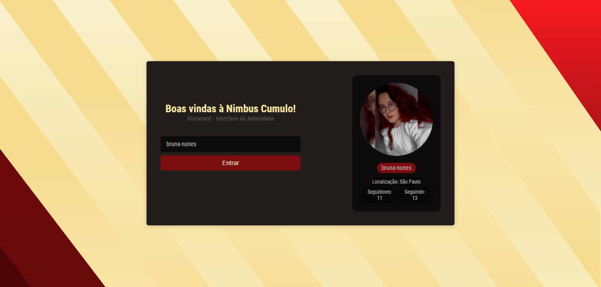

# Aluracord - Scythe

### Repositório para o projeto da Imersão React da @alura - 2022. Um chat feito com o tema que cada participante desejar :)
O tema escolhido por mim foi a trilogia de livros Scythe. O layout e cores do projeto foram baseados no design da capa do primeiro livro.




---

### :eyes: Para visualizar o projeto clique <a target="_blank" href="https://aluracord-scythe.vercel.app/">aqui<a>. Ou se preferir: 
1. Baixe ou clone este repositório

```
git clone https://github.com/bruna-nunes/aluracord-scythe.git
```
2. No diretório do projeto, instale as dependências do projeto

```
yarn install
```
3. Rode o comando para executar o projeto em modo de desenvolvimento
```
yarn dev
```
4. Acesse o endereço que foi fornecido no seu computador, através de qualquer navegador
---

### ⚙️ Funcionalidades

- Comunicação com a API do GitHub
- Opção de enviar e apagar mensagens no chat

---

### 🛠 Tecnologias e ferramentas utilizadas
- [Node.js](https://nodejs.dev)
- [ReactJS](https://pt-br.reactjs.org)
- [Next](https://nextjs.org)
- [SkynexUI](https://skynexui.dev)
- [Google Fonts](https://fonts.google.com/)
- [Figma (para desenvolvimento do background baseado no tema escolhido)](https://www.figma.com/)

---

### 🦸 Autora


Bruna Nunes


[](https://github.com/bruna-nunes)
[](https://www.linkedin.com/in/bruna-goes-nunes/)
[](mailto:brunanunes997@gmail.com)

---

### 📝 Licença

Este projeto esta sobe a licença [MIT](./license.txt).

